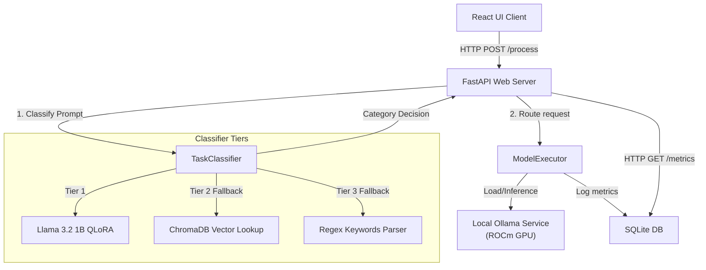

# 🛠️ Technical Design Document (TDD)
**Project:** Intelligent Multi-Model Fallback Router  

---

## 1. System Architecture Diagram



---

## 2. Classifier Component Sequence
1.  The user prompt is received.
2.  **Tier 1:** Query local Ollama model `llama3-router` (fine-tuned adapter weights on base Llama 3.2 1B). If valid routing JSON is generated, it is parsed and used.
3.  **Tier 2:** If the SLM fails, convert the prompt to embeddings using `nomic-embed-text` and query ChromaDB. The class matching the nearest neighbors is selected.
4.  **Tier 3:** If ChromaDB fails, run regex keyword matching.

---

## 3. Database Schema (SQLite)
Telemetries are persisted to `data/metrics.db` in the `requests` table:

```sql
CREATE TABLE requests (
  request_id TEXT PRIMARY KEY,
  timestamp DATETIME DEFAULT CURRENT_TIMESTAMP,
  prompt TEXT,
  task_type TEXT,
  prompt_length INTEGER,
  primary_model TEXT,
  fallback_model_used INTEGER, -- 0 or 1
  final_model_used TEXT,
  status TEXT,                -- 'success', 'failed'
  response TEXT,
  response_length INTEGER,
  tokens_used INTEGER,
  input_tokens INTEGER,
  output_tokens INTEGER,
  cost_usd REAL,
  latency_ms INTEGER,
  error_message TEXT
);
```

---

## 4. Virtual Token Pricing Matrix
To compute virtual cost metrics and compare them to a baseline single-model choice (Gemma-4 31B):

| Model Name | Input Cost (per 1M tokens) | Output Cost (per 1M tokens) |
| :--- | :--- | :--- |
| `ollama:minimax-m3` | \$0.15 | \$0.15 |
| `ollama:kimi-k2p7-code` | \$0.35 | \$0.35 |
| `ollama:gemma-4-26b-a4b-it` | \$0.80 | \$0.80 |
| `ollama:gemma-4-31b-it` | \$1.20 | \$1.20 |
| `ollama:gemma-4-31b-it-nvfp4` | \$1.00 | \$1.00 |
